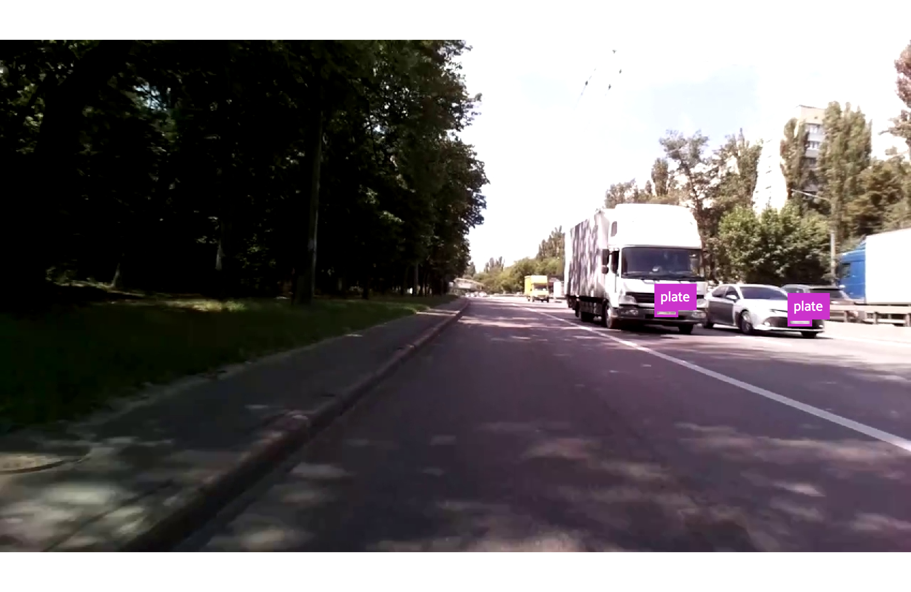

# License_plate_detection_dataset
A dataset to train deep neural license plate detector

Classes: ["plate", "background"]

Dataset has fiftyone COCODetectionDataset format and containts 3395 train images and 500 validation images

How to start:
1. Download the dataset from google drive (2.2 GB): https://drive.google.com/file/d/13UmKo2X_GifLN-uOEkCgjejwMj95o2jJ/view?usp=sharing
2. Install requirements:  pip3 install -r requirements.txt
3. Use:
python3 show_dataset.py -p DATASET_FOLDER_PATH    to watch train images
or
python3 show_dataset.py -p DATASET_FOLDER_PATH -v to watch validation images

I also trained few yolov5 models

yolov5s6 1280 with mAP 0.68: https://drive.google.com/file/d/1LL8zz7Ai0BwEswAqTC61d61_yxQUOlHZ/view?usp=sharing

yolov5n6 1280 with mAP 0.65: https://drive.google.com/file/d/1Q3w-7OzWxBXv20nZFoxoyOohJcyP2jvs/view?usp=sharing

Here is a repository which I used to train models:
https://github.com/ultralytics/yolov5

Example from the dataset:
